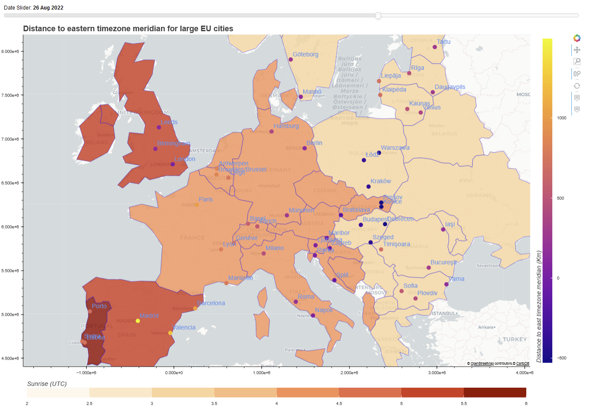

# Circadian Rythm EU
This repsitory implements an interactive map of Europe which allows
users to explore effects of daytimes and workingtimes on the circadian rythm.

**Link to deployed interactive visualization:** https://huggingface.co/spaces/philip-vonderlind/Circadian_Rythm



We currently use **HuggingFace Spaces** to deploy our visualization: \
https://huggingface.co/spaces/philip-vonderlind/Circadian_Rythm \
You will also find the deployment Dockerfile etc. in this Space.

### Usage
You can run the visualization yourself using the `circadian_rythm_interactive.ipynb` notebook. \
To use without dependency problems, it is recommended to use the Conda environment `environment.yml` as
kernel for your Jupyter server.

### Using Web Assembly
Web Assembly can be used to deploy Panel in a singular self-contained HTML/JS file, which then
uses Pyodide to locally install dependencies etc. \
This is offered by the Panel library per default. Below is
the command to convert the `index.py` to a html file and js file in the 
`docs` folder:

```bash
panel convert index.py --to pyodide-worker --out docs
```
